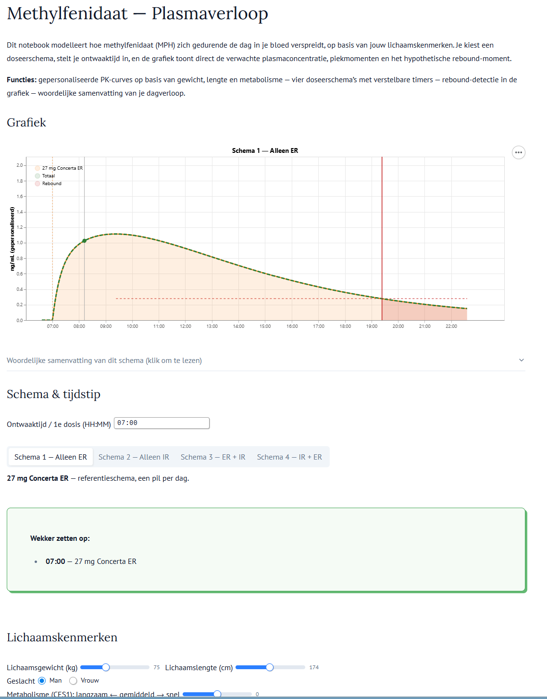

# methylfenidaat-curves

Dit notebook modelleert hoe methylfenidaat (MPH) zich gedurende de dag in je bloed verspreidt, op basis van jouw lichaamskenmerken. Je kiest een doseerschema, stelt je ontwaaktijd in, en de grafiek toont direct de verwachte plasmaconcentratie, piekmomenten en het hypothetische rebound-moment.

